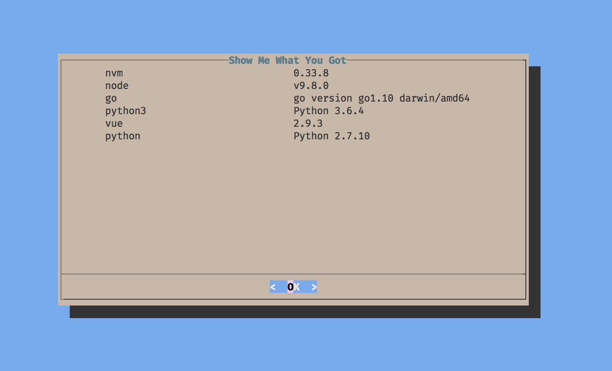

# Show Me What You Got
A simple *silly* script that shows the installed versions of a few key tools I use. It has been written for **Bash 4**

Usage:
```sh
$ showMeWhatYouGot
```
This will show a dialog in the terminal

